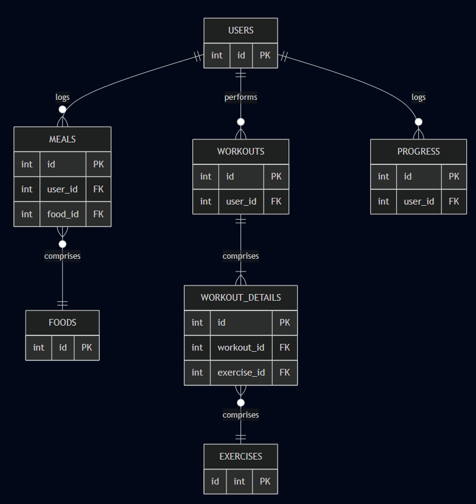

# Design Document

By Erick Khosasi

Video overview: https://youtu.be/aYOIYp2XRP0

## Scope

The database for the fitness tracker apps includes all entities necessary to facilitate the feature of tracking user physical progress, meal, and workout sessions. As such, included in the database's scope is:
* **users**, including basic identifying information
* **exercises**, including master list of exercises and their details
* **foods**, including master list of foods and their macronutrients value
* **workouts**, which logs each workout session performed by user
* **workout_details**, which breakdown the exercises performed by user in each workout session
* **meals**, which logs what user eats on specific day
* **progress**, which logs user physical progress over time

## Functional Requirements

This database will support:

* CRUD operations for users and admin
* Tracking all workout sessions, diets, and physical progress of user, including their summary and trends

## Representation

Entities are captured in SQLite tables with the following schema.

### Entities

The database includes the following entities:

#### Users

The `users` table includes:

* `id`, which specifies the unique ID for the user as an `INTEGER`. This column thus has the `PRIMARY KEY` constraint applied.
* `first_name`, which specifies the user's first name as `TEXT`, given `TEXT` is appropriate for name fields.
* `last_name`, which specifies the user's last name. `TEXT` is used for the same reason as `first_name`. This field is optional as there are some people who doesn't have last name.
* `username`, which specifies the user's username. `TEXT` is used for the same reason as `first_name`. A `UNIQUE` constraint ensures no two users have the same username.
* `gender`, which specifies the user's gender. `TEXT` is used for the same reason as `first_name`. This field is optional, but a `CHECK` constraint is applied to enter the correct choice of gender.
* `birth_date`, which specifies the user's date of birth. Dates in SQLite can be conveniently stored as `NUMERIC`, per SQLite documentation at <https://www.sqlite.org/datatype3.html>. This field is optional.
* `height_cm`, which specifies the user's height in cm as `REAL`, given `REAL` is appropriate for measurement fields. This field is optional.
* `weight_kg`, which specifies the user's weight in kg. `REAL` is used for the same reason as `height_cm`. This field is optional.

The `first_name` and `username` columns are required and hence should have the `NOT NULL` constraint applied.

#### Exercises

The `exercises` table includes:

* `id`, which specifies the unique ID for the exercise as an `INTEGER`. This column thus has the `PRIMARY KEY` constraint applied.
* `name`, which specifies the exercise's name as `TEXT`. A `UNIQUE` constraint ensures no duplicate exercises are registered in the master list.
* `muscle_group`, which specifies the targeted muscle group as `TEXT`.
* `type`, which specifies the type of exercise movement as `TEXT`. A `CHECK` constraint is applied as there are only two type of movements, which are compound and isolation.

All columns in the `exercises` table are required and hence should have the `NOT NULL` constraint applied. No other constraints are necessary.

#### Foods

The `foods` table includes:

* `id`, which specifies the unique ID for the food as an `INTEGER`. This column thus has the `PRIMARY KEY` constraint applied.
* `name`, which is the name of the food as `TEXT`. A `UNIQUE` constraint ensures no duplicate foods are registered in the master list.
* `calories`, which specifies the food's calories as `REAL`.
* `carbs_g`, which specifies the food's carbs in g as `REAL`.
* `protein_g`, which specifies the food's protein in g as `REAL`.
* `fat_g`, which specifies the food's fat in g as `REAL`.
* `serving_size_g`, which specifies the serving size of the food in g used to measure its nutrients as `REAL`.

All columns in the `foods` table are required, and hence should have the `NOT NULL` constraint applied. No other constraints are necessary.

#### Workouts

The `workouts` table includes:

* `id`, which specifies the unique ID for the workout session as an `INTEGER`. This column thus has the `PRIMARY KEY` constraint applied.
* `user_id`, which is the ID of the user who performed the workout session as an `INTEGER`. This column thus has the `FOREIGN KEY` constraint applied, referencing the `id` column in the `users` table to ensure data integrity.
* `date`, which specifies the date of the session as `NUMERIC`. The default value for `date` field is the current date in local time, as stated by `DEFAULT CURRENT_DATE`.
* `duration_h`, which specifies the duration of the session in hours as `REAL`.
* `notes`, which is a free text field for user to note any information as `TEXT`. This field is optional.

The `date` and `duration_h` columns are required and hence have the `NOT NULL` constraint.

#### Workout Details

The `workout_details` table includes:

* `id`, which specifies the unique ID for the workout detail as an `INTEGER`. This column thus has the `PRIMARY KEY` constraint applied.
* `workout_id`, which specifies the ID of the workout session as an `INTEGER`. This column thus has the `FOREIGN KEY` constraint applied, referencing the `id` column in the `workouts` table, which ensures that each workout detail be referenced back to a workout session.
* `exercise_id`, which specifies the ID of the exercise performed as an `INTEGER`. This column thus has the `FOREIGN KEY` constraint applied, referencing the `id` column in the `exercises` table, which ensures each workout detail enatils a particular exercise.
* `sets`, which specifies the total number of sets of the exercise performed as an `INTEGER`.
* `reps`, which specifies the total number of reps of each sets performed as an `INTEGER`.
* `weight_kg`, which specifies the total weight in kg used for the exercise as an `REAL`.

All columns are required and hence have the `NOT NULL` constraint applied where a `PRIMARY KEY` or `FOREIGN KEY` constraint is not. To ensure that each exercise with the same weight appears only once per workout session, a `UNIQUE` constraint is applied on the combination of `workout_id`, `exercise_id`, and `weight_kg`. This enforces that total sets and reps for a given exercise within a session are summarized into a single record

#### Meals

The `meals` table includes:

* `id`, which specifies the unique ID for the user's meal as an `INTEGER`. This column thus has the `PRIMARY KEY` constraint applied.
* `user_id`, which is the ID of the user who performed the workout session as an `INTEGER`. This column thus has the `FOREIGN KEY` constraint applied, referencing the `id` column in the `users` table to ensure data integrity.
* `date`, which specifies the date of the meal as `NUMERIC`. The default value for `date` field is the current date in local time, as stated by `DEFAULT CURRENT_DATE`.
* `food_id`, which specifies the ID of the food as an `INTEGER`. This column thus has the `FOREIGN KEY` constraint applied, referencing the `id` column in the `foods` table, which ensures each meal comprised of a particular food.
* `meal_type`, which specifies the type of meal as `TEXT`. A `CHECK` constraint is applied as there are only certain type of meal in a day (breakfast, lunch, dinner, snack).
* `serving_size_g`, which specifies the serving size of the meal in g as `REAL`.
* `notes`, which is a free text field for user to note any information as `TEXT`. This field is optional.

The `date`, `meal_type`, and `serving_size_g` columns are required and hence have the `NOT NULL` constraint. To prevent users from logging the same food multiple times within the same meal, a `UNIQUE` constraint is applied on the combination of `user_id`, `date`, `meal_type`, and `food_id` columns.

#### Progress

The `progress` table includes:

* `id`, which specifies the unique ID for the user's progress log as an `INTEGER`. This column thus has the `PRIMARY KEY` constraint applied.
* `user_id`, which is the ID of the user who performed the workout session as an `INTEGER`. This column thus has the `FOREIGN KEY` constraint applied, referencing the `id` column in the `users` table to ensure data integrity.
* `date`, which specifies the date of the log as `NUMERIC`. The default value for `date` field is the current date in local time, as stated by `DEFAULT CURRENT_DATE`.
* `weight_kg`, which specifies the user's weight in kg as `REAL`.
* `body_fat`, which specifies the user's body fat in % as `REAL`.
* `muscle_mass`, which specifies the user's muscle mass in % as `REAL`,
* `notes`, which is a free text field for user to note any information as `TEXT`. This field is optional.

The `date`, `weight_kg`, `body_fat`, and `muscle_mass` columns are required and hence have the `NOT NULL` constraint. To ensure that each user can log only one progress record per day, a `UNIQUE` constraint is applied on the combination of `user_id` and `date` columns.

### Relationships

The below entity relationship diagram describes the relationships among the entities in the database.

As detailed by the diagram:

* One user is capable of performing 0 to many workout sessions: 0, if they have yet to log any session, and many if they log more than one session. A workout session is performed by one and only one user.
* A workout session can comprises of one to many workout details: 1, if the session comprises of only one workout detail (only 1 type of exercise using same reps and weight), and many if the session comprises of more than one workout detail. At the same time, a workout detail is associated with one and only one workout session.
* A workout detail is associated with one and only one exercise. At the same time, an exercise can be associated with 0 to many workout detail: 0 if no users have yet performed the exercise, and many if the exercise has been performed multiple times by users.
* One user is capable of logging 0 to many meals: 0, if they have yet to log any meal, and many if they log more than one meal. A meal is logged by one and only one user.
* A meal is associated with one and only one food. At the same time, a food can be associated with 0 to many meals: 0 if no meal have yet to include the food, and many if the food has been logged in multiple tracker.
* One user is capable of logging 0 to many progress: 0, if they have yet to log any session, and many if they log more than one progress. A progress log is associated with one and only one user.

## Optimizations

Per the typical queries in `queries.sql`, the following indexes are recommended to improve query performance:
* `username` in `users`: Frequently used to identify or authenticate users.
* `user_id` in `workouts`, `meals`, `progress`: Commonly used to retrieve all logs from a specific user.
* `date` in `workouts`: Useful for filtering logs by date or generating insights over time.
* `workout_id` in `workout_details`: To JOIN workouts and workout_details table efficiently.

## Limitations

The database is currently only functional for individual fitness tracking. Several limitations still exist:
* No support for social media feature and coaching session
* Limited goal-setting functionality
* No support for complex meal recipes: Meals only track individual food items. Meals consisting of multiple foods need to be logged in separately.
* No support to log duration-based exercise (e.g. plank, wall-sit, deadhang)

There are some improvement ideas that could be implemented in the future:
* Social media feature
* Personal trainer profile and coaching session scheduling
* Community challenges
